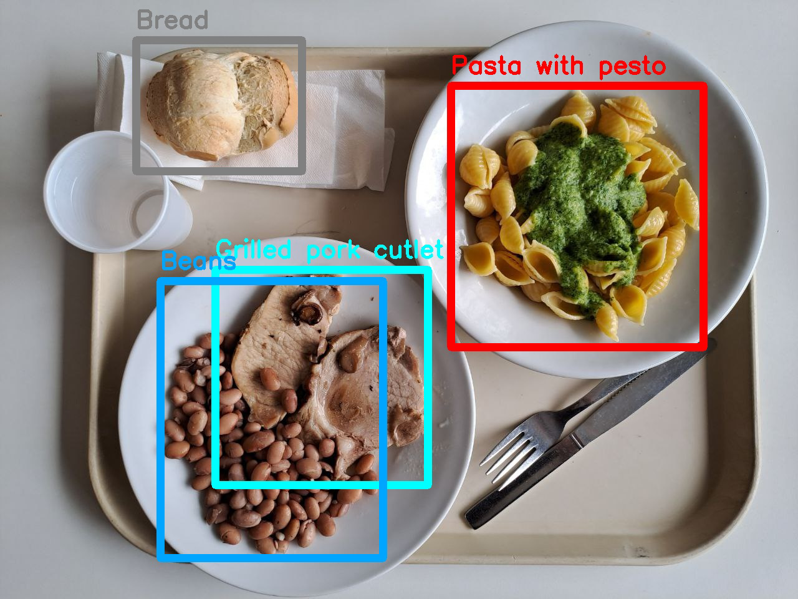

<br/>
<br/>
<br/>


<p align="center">
  
</p>
<h1 align="center">
    <a href="https://github.com/Piero24/Food-recognition-and-leftover-estimation">Food Recognition and Leftover Estimation</a>
</h1>
<p align="center">
    <a href="https://github.com/Piero24/Food-recognition-and-leftover-estimation/commits/master">
    
    </a>
    <a href="https://github.com/Piero24/Food-recognition-and-leftover-estimation">
    
    </a>
    <a href="https://github.com/Piero24/twitch-stream-viewer/issues">
    
    </a>
    <a href="https://github.com/Piero24/Food-recognition-and-leftover-estimation/blob/master/LICENSE">
    
    </a>
</p>
<p align="center">
    An awesome leftover estimator!
    <br/>
    <a href="https://github.com/Piero24/Food-recognition-and-leftover-estimation/blob/main/CV_22_23-Summer%20project.pdf"><strong>Explore the docs »</strong></a>
    <br/>

</p>

<br/><br/>
<h2 id="introduction">📔  Introduction</h2>
<p>
    The goal of this project is to develop a computer vision system capable of scanning a canteen consumer's food tray at the end of a meal to estimate the amount of leftovers for each type of food. Such a system must be able to analyze pairs of images: one of the tray before the meal and one of the tray at the end of the meal. From the first image, the system will recognize the various types of food ordered, keeping track of the initial quantity of each food; at the end of the meal, the system must analyze a new image of the tray, recognizing which types of food are still present and in what quantity.

</p>
<br/>

<br/>
<br/>


<h2 id="made-in"><br/>🛠  Built in</h2>
<p>
    The project was developed in C++ using the OpenCV library and employing image processing techniques learned during the Computer Vision course.

    It's important to note that the code could have been written using Deep Learning 
    approaches (Not Machine Learning), which would have significantly simplified and 
    improved food detection. However, I chose to develop the project exclusively with 
    the knowledge acquired during the course to apply what I've learned and directly 
    tackle the challenges and problems.
</p>
<br/>
<p align="center">
    C++ • <a href="https://opencv.org">OpenCV</a> • Computer Vision
</p>


<p align="right"><a href="#top">⇧</a></p>


<h2 id="how-to-start"><br/>⚙️  How to Start</h2>
<p>
    Below there is an example of how you can run the project.
</p>
<br/>

1. Clone the repo
  
```sh
git clone https://github.com/Piero24/Food-recognition-and-leftover-estimation.git
```

2. Install OpenCV. details can be found <a href="https://docs.opencv.org/4.x/d7/d9f/tutorial_linux_install.html">Here</a>

3. Position the terminal in the folder containing the downloaded repo folder 

4. Set up the project with CMake
  
```sh
cmake 
```

5. Compile the project
  
```sh
make 
```

6. Start the project
  
```sh
./Food-Recognition ./Food-recognition-and-leftover-estimation/dataset
```
Where `./Food-recognition-and-leftover-estimation/dataset` is the path of the dataset

<p align="right"><a href="#top">⇧</a></p>


---
> *<p align="center"> Copyright (C) by Pietrobon Andrea <br/> Released date: Jul-21-23*
